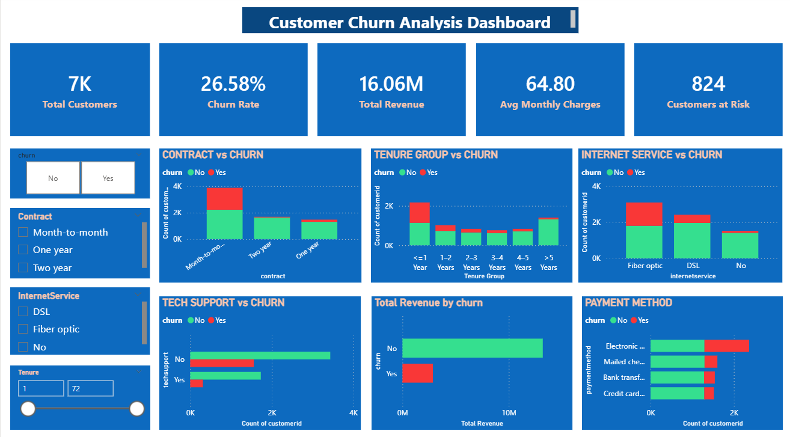

# Customer Churn Analysis Dashboard

## Overview
This project analyzes customer churn behavior using telecom data.  
The objective is to identify key factors driving churn and provide actionable business insights.

---

## Tools and Technologies
- Python (Data Cleaning)
- PostgreSQL (Data Analysis)
- Power BI (Data Visualization)

---

## Dashboard Preview

---

## Key Insights
- Month-to-month contracts show the highest churn rate
- Customers with low tenure (less than 1 year) are at high risk
- Lack of tech support significantly increases churn
- Higher monthly charges are associated with higher churn
- Fiber optic users show higher churn trends

---

## Features
- Interactive Power BI dashboard
- KPI tracking (Churn Rate, Revenue, High-Risk Customers)
- Customer segmentation analysis
- Identification of key churn drivers

---

## Project Files
- clean_churn.csv – Cleaned dataset
- churn_dashboard.pbix – Power BI dashboard
- CustomerChurnKPIs.sql – SQL analysis queries

---

## Conclusion
Churn is mainly driven by contract type, tenure, service support, and pricing.  
Improving customer support and encouraging long-term contracts can help reduce churn.
